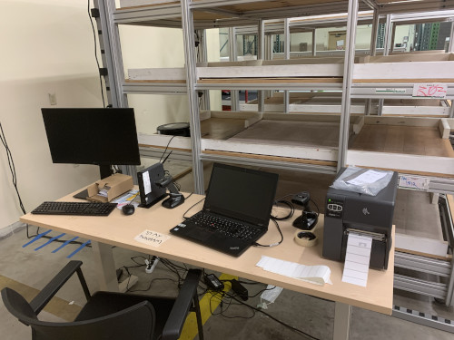
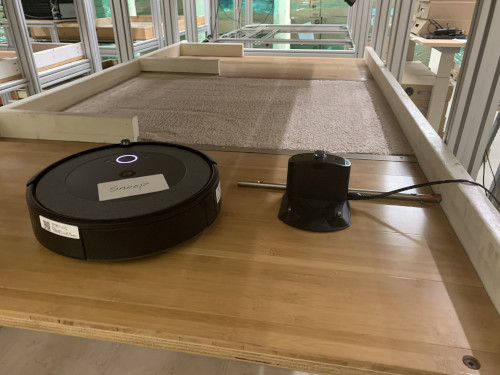

# Testing Roombas at iRobot - Challenges and Solutions
At iRobot a lot of our Roomba reliability testing was manual.  An engineer would physically baby-sit robots through missions and would read the resulting data directly from the robots when they were done.  Given that the robots constantly "talked" to the cloud (at least in production), there seemed room to automate the process with the ultimate goal of moving the testing offshore, either to Mexico or China.

What we envisioned was a testing facility where many robots running on testbeds could be monitored by a technician at a workstation using a web interface.  Using the web interface, the technician could easily see when robots were stuck, out of batteries or broken and move to address the problem.  Additionally, we set up our own testing cloud to capture all of the events the robots were reporting in order to derive metrics like mean-time-to-failure, mean-battery-life, etc.

There were a *lot* challenges with this project.  Getting the cloud set up, onboarding robots, and building the data pipeline were some highlights.  Thankfully I had a great team and we overcame each obstacle one by one.

Alas, I don't have any photos of the application (which, while complex, was really neat) and the code is iRobot's IP.  However, I can build a mini-version that outlines some things I talked about with Nate.

# BD Robot Events
A demonstration of how to create tools that allow users to
- easily find robot event data 
- export the data for use with existing internal BD software tools
- share their data across the organization

Nate and I also talked about how to automate work in the future.  For example, rather than save the data locally, it would be great to send the data produced along to another API or script that mimicked the existing BD software.

## Keeping things simple
This presentation is supposed to be short (20 minutes), so we are going to keep things dead simple.  That means no auth implementation, unit testing, containerization, etc.  You're all so terribly disappointed, I can tell.

At the most basic level, this tool grants users access to a data store, in this case MongoDB.  In practice, the same techniques could be used to search log files or data from other APIs.  

FastApi with Uvicorn is a nice quick way to create API routes using Python, which in turn can connect to Mongo using the pymongo plugin.  

Finally, we have a React app that presents a simple user interface so that users can sift through the data without having to learn SQL.

## Data generation

First, we will create some users.  MongoDB has a built-in USER_ROLES collection/table, and that allows very precise control over what users can and cannot do.  But it's overkill for this demo, so we can just create a "Tester" collection.